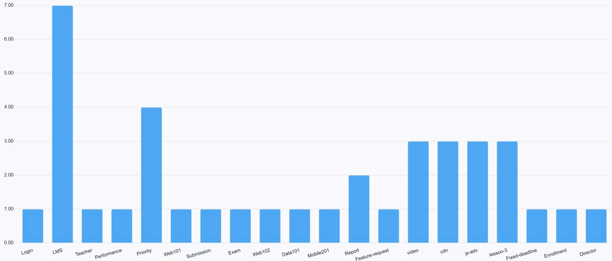
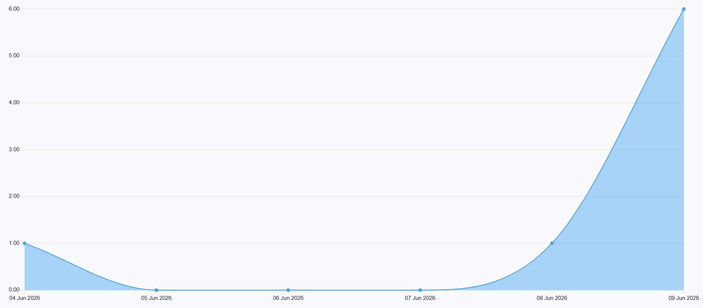
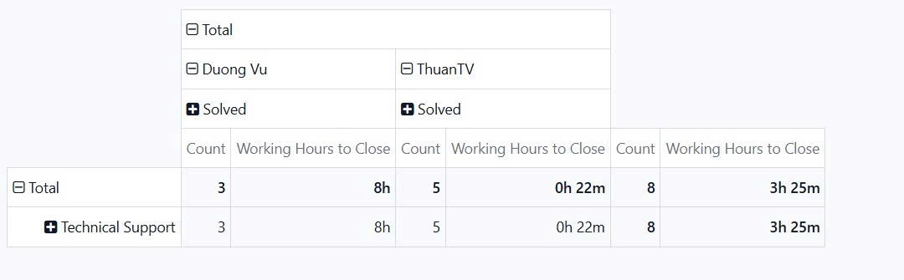

# BÁO CÁO PHÂN TÍCH QUY LUẬT DỮ LIỆU (PATTERN ANALYSIS DOCUMENT)

**Người lập báo cáo:** Vũ Đức Dương
**Giai đoạn thực hiện:** Tuần 5 - Reporting, Analysis & Automation Implementation  
**Mục tiêu:** Áp dụng phương pháp vận hành dựa trên dữ liệu (data-driven operations) để phân tích mẫu ticket và đề xuất tự động hóa.  

---

## Phần 1: Thu thập Dữ liệu (Data Collection)
Dữ liệu được sử dụng trong báo cáo này được trích xuất trực tiếp từ môi trường vận hành thực tế:
* **Nguồn dữ liệu:** Hệ thống Odoo Helpdesk.
* **Phạm vi thời gian:** Toàn bộ dữ liệu ticket phát sinh trong Tuần 4.
## Phần 2: Phương pháp Gom nhóm (Grouping)
Để chuyển đổi dữ liệu thô thành thông tin có ý nghĩa, hệ thống đã áp dụng các bộ lọc và gom nhóm theo cấu trúc:
* **Nhóm theo Danh mục (By category):** Phân rã dữ liệu theo các thẻ (tags) và loại lỗi (Ticket Type) để tìm ra nhóm có tỷ trọng cao nhất.
* **Nhóm theo Tần suất (By frequency):** Đếm tổng số lượng (Count) ticket trên mỗi phân loại thông qua Pivot View.
* **Nhóm theo Thời gian:** Theo dõi biến động khối lượng yêu cầu qua từng ngày (Daily ticket summary).

## Phần 3: Nhận diện Quy luật (Pattern Finding)
Thông qua phân tích hình ảnh và biểu đồ, hệ thống đã nhận diện được các sự cố có tính chất lặp lại (Systemic patterns):

1. **[Lỗi đăng nhập và thao tác với phần mềm LMS]** (Chiếm tỷ trọng áp đảo)
2. **[Lỗi các video bài học liên quan đến js-adv]**
3. **[Lỗi liên quan đến mạng CDN]**
4. **[Lỗi nộp bài trong các bài kiểm tra, kỳ thi]**

## Phần 4: Đánh giá Tác động (Impact Analysis)
Trọng tâm phân tích được đặt vào vấn đề đăng nhập với LMS do tác động tiêu cực của nó lên hệ thống:
* **Lượng người dùng bị ảnh hưởng (Users affected):** Rất lớn.
* **Ảnh hưởng nghiệp vụ (Business impact):** Gây gián đoạn công việc ngay từ khâu truy cập, tạo ra trải nghiệm tồi tệ cho người dùng.
* **Chi phí thời gian của Đội ngũ (Team time cost):** Mỗi ticket tiêu tốn trung bình từ 30 phút thao tác thủ công. Với tần suất khoảng 5 ticket/tuần, đội ngũ đang lãng phí 3-4 giờ chỉ để xử lý một thao tác lặp lại vô nghĩa.

## Phần 5: Phân tích Nguyên nhân Gốc rễ (Root Cause)
Tiến hành điều tra sâu vào vấn đề lỗi đăng nhập:
* **Tại sao vấn đề xảy ra? (Why happening?):** Hệ thống có thiết lập một quy tắc (code-level rule) tự động vô hiệu hóa các tài khoản nếu không có hoạt động trong vòng 30 ngày (30 days inactivity).
* **Bằng chứng (Evidence):** Lịch sử mô tả ticket từ người dùng luôn có nội dung báo lỗi khóa tài khoản sau thời gian dài không đăng nhập.

## Phần 6: Đề xuất Giải pháp (Solutions)
Dựa trên phân tích, có hai lựa chọn chính để xử lý vấn đề:

1. **Sửa mã nguồn (Code Fix):** Yêu cầu bộ phận Software Engineer can thiệp thay đổi luật 30 ngày.  
   *Nhược điểm:* Cần thời gian dài (nhiều ngày/tuần), phải kiểm thử lại diện rộng.
2. **Triển khai Tự động hóa (Automation Workaround):** Xây dựng luồng tự động để tiếp nhận, kiểm tra dữ liệu qua API HR và mở khóa.  
   *Ưu điểm:* Triển khai thần tốc trong vài giờ, không cần đụng vào code gốc, giải quyết lập tức sự cố diện rộng.